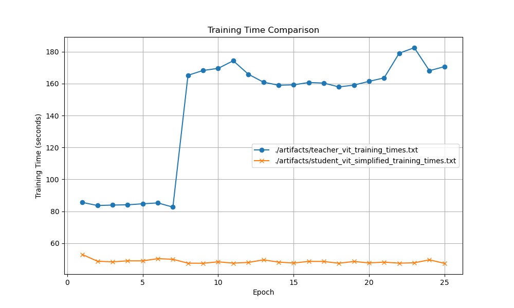
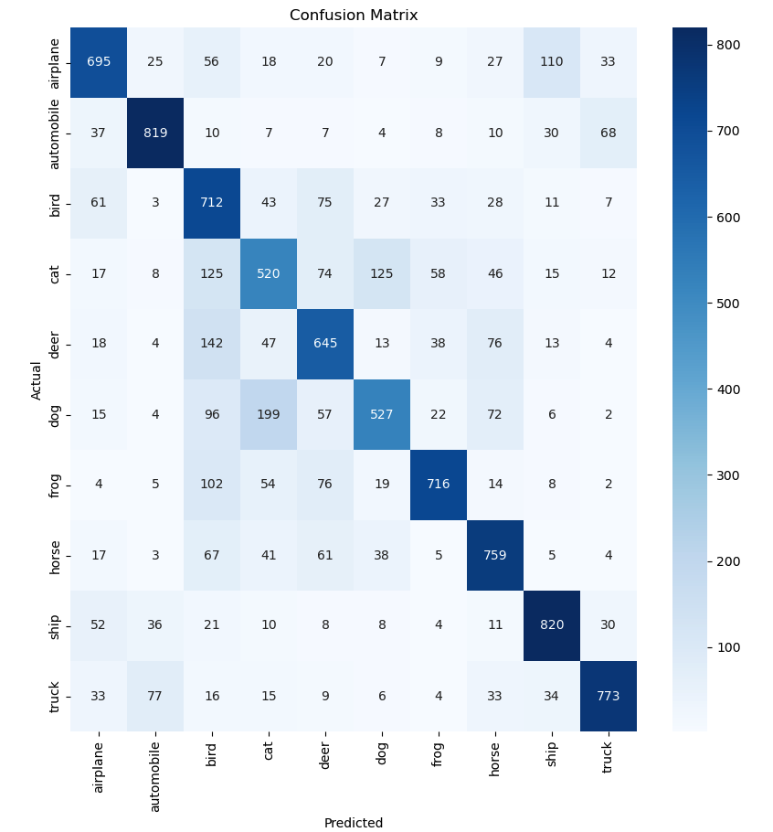

# Model Compression

Objective:
- freeze all weights from large model with cell/block structure
- swap out module for smaller or easier to parrellize module
- train for epoch
- evaluate keep original module or not
- iterate all layers


## Knowledge Distillation

Objective: train ViT > 90% accuracy, then train smaller models (how much smaller?)
with various improved architecutres on the output from the larger model, still eval on same withhold set

Largest baseline tranformer is out of box typically transformer with

Model Parameters: 2140426

From config:
```
patch_size = 4   # Size of the patches to be extracted from the images
dim = 256        # Dimension of the transformer layers
depth = 4        # Number of transformer blocks
heads = 4        # Number of heads for the multi-head attention
mlp_dim = 512    # Dimension of the feed-forward network
```

**Results:**

20th epoch: 67% accuracy
25th epoch: 68.5% accuracy


If not able to improve might want to pivot to pretrained backbone to avoid computation overhead

**Training specifics**

Pass inputs through student model
Pass inputs through teacher model
Use custom KL divergence + cross entropy loss with outputs from student, teacher, and true labels

Output of larger model is now a probability vector rather than a sparse label which will improve efficiency of learning

**Baseline student eval**:
* training off the 15th epoch from teacher models gives 61% accuracy with only 550k params
* Only major change is that used a depth of 1 (only one transformer block)

**Improved**: Using the simplified transformer block and better teacher
* training off the 25th epoch from teacher model (68% accuracy) yielded 61% accuracy after 15 epochs
* each epoch trained in under 50 seconds

**Eval on training time differences:**
* Training on one GPU forced it to share the load which isn't entirely fair, but still student model must faster training time per epoch
* Therefore, the increase in training time seen in the following graph isn't a valid spike, however, the baseline from the beginning was still larger than that of student
* reran student training alone and saw drastic speedup in time >10seconds even in early epochs where learning rate is high





## Improved Tranformer Blocks

1. Removed normalization
2. Removed MLP in sequence with attention to run in parrelel
3. Removed parameters for value and projection layers

Creating new custom tranformer blocks now for experimentation