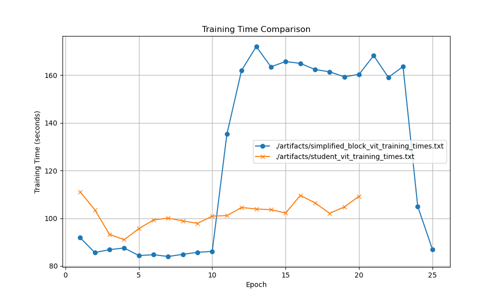

# Model Compression

Objective:
- freeze all weights from large model with cell/block structure
- swap out module for smaller or easier to parrellize module
- train for epoch
- evaluate keep original module or not
- iterate all layers


## Knowledge Distillation

Objective: train ViT > 90% accuracy, then train smaller models (how much smaller?)
with various improved architecutres on the output from the larger model, still eval on same withhold set

Largest baseline tranformer is out of box typically transformer with 

1877258 parameters

```
patch_size = 4   # Size of the patches to be extracted from the images
dim = 256        # Dimension of the transformer layers
depth = 4        # Number of transformer blocks
heads = 4        # Number of heads for the multi-head attention
mlp_dim = 512    # Dimension of the feed-forward network
```

By 20th epoch achieves 67% accuracy

If not able to improve might want to pivot to pretrained backbone to avoid computation overhead

**Training specifics**

Pass inputs through student model
Pass inputs through teacher model
Use custom KL divergence + cross entropy loss with outputs from student, teacher, and true labels

Output of larger model is now a probability vector rather than a sparse label which will improve efficiency of learning

Eval on training time differences:
* Training on one GPU forced it to share the load which isn't entirely fair, but still student model must faster training time per epoch



## Improved Tranformer Blocks

1. Removed normalization
2. Removed MLP in sequence with attention to run in parrelel
3. Removed parameters for value and projection layers

Creating new custom tranformer blocks now for experimentation